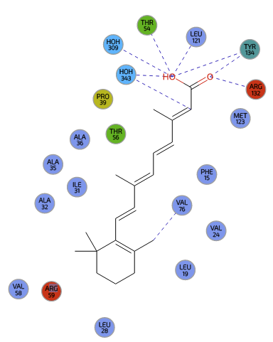
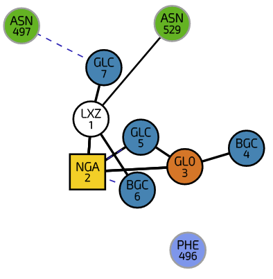
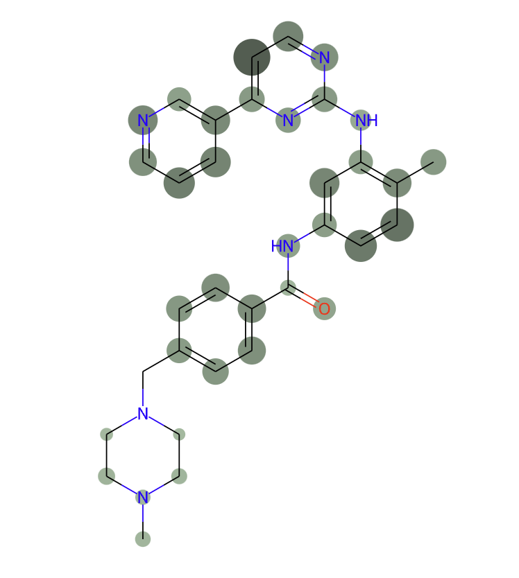

# PDB LigandEnv component

This is a web-component to display ligand structure in 2D along with its interactions. Ligand can be perceived as a set of covalently linked pdb residues (refered to as bound molecule) or a single pdb residue. This depiction can be enriched with substructure highlight, atom names, binding site interactions and aggregated protein-ligand interactions.

## Installation

```shell
npm install
npm run build
npm run start

open any of the *.html pages in the demo directory
```
To see demo, copy demo directory to build and open any of the html pages.

## Component modes

* Mode A: Display ligand and its interactions (Using pdb-id, pdb-res-id and pdb-chain-id)
* Mode B: Display boundmolecule and its interactions (Using pdb-id and bound-molecule-id)
* Mode C: Display ligand only (Using pdb-res-name)
* Mode D: Display ligand and aggregated interactions (Using pdb-res-name and contact-type)

| Mode A | Mode B | Mode C | Mode D |
|:------------------: | :-------: | :-------: | :-------: |
| |  |  |  |
| [1cbs REA 200 A](https://www.ebi.ac.uk/pdbe/entry/pdb/1cbs/bound/REA) | [3D12 bm1 (`2xGLC-2xBGC-LXZ-NGA-GL0`)](https://www.ebi.ac.uk/pdbe/entry/pdb/3d12/branched/4)| [wwPDB CCD - VIA](https://pdbe.org/chem/VIA) | STI |

## How to use it

PDB LigandEnv can be inserted into web pages in two different ways. Either as a `web-component` using html tag, or directly by using javascript as a `plugin`.

Interactions data displayed by the component can come from three different environments `Production`, `Development`, `Internal`. If no environment is specified `Production` is used as default..

### Web-component

A few files needs to be imported in the page before the component is attempted to be loaded:

```html

<!-- D3 -->
<script src="https://d3js.org/d3.v5.min.js"></script>

<!-- CSS style to be used for scene drawing (required for saving SVGs.) -->
<link rel="stylesheet" href="pdb-ligand-env-svg.css" />

<!-- CSS style to be used for the component UI -->
<link rel="stylesheet" href="pdb-ligand-env.css" />

<!-- UI icons -->
<link rel="stylesheet" href="https://ebi.emblstatic.net/web_guidelines/EBI-Icon-fonts/v1.3/fonts.css" />

<!-- Web component polyfill (only loads what it needs) -->
<script src="https://cdn.jsdelivr.net/npm/@webcomponents/webcomponentsjs/webcomponents-lite.js" charset="utf-8"></script>
<script src="https://cdn.jsdelivr.net/npm/@webcomponents/webcomponentsjs/custom-elements-es5-adapter.js"
    charset="utf-8"></script>

<!--PDBe interactions component-->
<script type="module" src="pdb-ligand-env-component-2.0.0-min.js"></script>
```

#### A) Ligand interactions

```html
<pdb-ligand-env pdb-id="1cbs" pdb-res-id="200" pdb-chain-id="A" environment="development"></pdb-ligand-env>
```

#### B) Bound molecule interactions

```html
<pdb-ligand-env pdb-id="3d12" bound-molecule-id="bm1"></pdb-ligand-env>
```

#### C) Ligand

```html
<pdb-ligand-env pdb-res-name="CLR" zoom-on ></pdb-ligand-env>
```

#### D) Ligand and aggregated interactions
```html
<pdb-ligand-env pdb-res-name="STI", contact-type=["hbond","hydrophobic","vdw"]></pdb-ligand-env>
```

The component contains a number of properties that can be set, in order to change data that are being displayed. First you need to define a component on the page:

```html
<pdb-ligand-env id='SIA-component'></pdb-ligand-env>
```

and then inject data you want to display e.g.:

```javascript
let chemUrl = `https://www.ebi.ac.uk/pdbe/static/files/pdbechem_v2/SIA/annotation`;
let interactionsURL = "https://wwwdev.ebi.ac.uk/pdbe/graph-api/pdb/bound_ligand_interactions/4yy1/A/604";
let component = document.getElementById('SIA-component');
(async() => {
    const depiction = await (await fetch(chemUrl)).json();
    const interactionsData = await (await fetch(interactionsURL)).json();
    const atomsToHighlight = ['C10', 'C11', 'O10'];

    component.depiction = depiction;
    component.ligandHighlight = atomsToHighlight;
    component.interactions = interactionsData;
})()
```

### Plugin

The component can be also added to DOM directly from JavaScript. There are some requirements

```html

<!-- D3 -->
<script src="https://d3js.org/d3.v5.min.js"></script>

<!-- CSS style to be used for scene drawing (required for saving SVGs.) -->
<link rel="stylesheet" href="pdb-ligand-env-svg.css" />

<!-- UI icons -->
<link rel="stylesheet" href="https://ebi.emblstatic.net/web_guidelines/EBI-Icon-fonts/v1.3/fonts.css" />

<!--PDB ligand environment plugin-->
<script src="pdb-ligand-env-plugin-min.js"></script>
<link rel="stylesheet" href="pdb-ligand-env.css" />

```

and then the component can be instantiated as simply as:

```javascript
let component = document.getElementById('SIA-component');
let environemnt = "development";
let uiParams = {
    reinitialize: true, // allow reinitialize option in the component menu
    zoom: true, // allow scene zoom
    fullScreen: true, // allow allow full screen option in the component menu
    downloadImage: true, // allow image download from  the component menu
    downloadData: true, // allow interactions data download from compoment menu
    center: true, // allow scene centering option from the component menu
    help: false, // allow help option from the component menu
    residueLabel: true, // show residue label
    tooltip: true // show residue tooltip on mouse hover
    menu: true // allow menu to be (not) available
    names: true // allow ligand depiction with atom names
};

this.display = new Visualization(this, uiParams, environment);

// to display bound molecule interactions
this.display.initBoundMoleculeInteractions('3d12', 'bm1');
// to display carbohydrate polymer interactions
this.display.initCarbohydratePolymerInteractions('5e98', 'bm1','3');
// to display ligand interactions
this.display.initLigandInteractions('1cbs', 200, 'A');

// to display chemical component with atom names only
this.display.initLigandDisplay('HEM', true);

// to display aggregated protein-ligand interactions
this.display.initLigandDisplay('STI').then(() => {
    this.display.initLigandWeights('STI').then(() => {
        this.display.showWeights(["hydrophobic"]);
    })
})
````

## Parameters

| Parametr            | Type      | Required | Description |
|-------------------- | --------- | -------- | -------     |
| pdb-id              | string    | No       | PDB id of a protein to retrieve interactions from. `(mode A and B only)` |
| bound-molecule-id   | string    | No       | PDB bound molecule id `(mode A only)` |
| pdb-res-name        | string    | No       | PDB residue name aka: *auth_comp_id* `(mode C only)`
| pdb-res-id          | number    | No       | PDB residue id aka: *auth_seq_id* `(mode B only)` |
| contact-type        | string[]  | No       | protein-ligand contact_type calculated by pdbe-arpeggio `(mode D only)` | 
| pdb-chain-id        | string    | No       | PDB residue chain aka: *auth_asym_id*  `(mode B only)`|
| substructure        | string[]  | No       | List of atom names to be highlighted on the ligand structure |
| color               | string    | No       | HEX representation of the color highlight. `(Default: #D3D3D3)` |
| zoom-on             | boolean   | No       | Allow zoom functionality on the component level. |
| depiction-only      | boolean   | No       | Disables UI features, required to avoid downloading file needed for interactivity| 
| names-on            | boolean   | No       | Allow ligand depiction to be displayed with atom names. |
| environment         | string    | No       | What data should be used: one of `production`, `development`, `internal` or a shorthand `prod`, `dev`, `int`. |


## Versioning

We use [SemVer](http://semver.org/) for versioning. For the versions available, see the [tags on this repository](https://github.com/PDBeurope/ligand-env/tags).

## Authors

* **Lukas Pravda** - *Initial work* - [lpravda](https://github.com/lpravda)
* **Mihaly Varadi** - *Migrating to GitHub* - [mvaradi](https://github.com/mvaradi)
* **Ibrahim Roshan** - *Aggregated interactions view* - [roshkjr](https://github.com/roshkjr)
* **Marcelo Afonso** - *Migrating v2 to GitHub* - [marcelo-q](https://github.com/marcelo-q)

See also the list of [contributors](https://github.com/PDBeurope/ligand-env/contributors) who participated in this project.

## License

This project is licensed under the EMBL-EBI License - see the [LICENSE](LICENSE) file for details

## Acknowledgements

We would like to thank the [PDBe team](https://www.pdbe.org) for their feedback and contributions.
